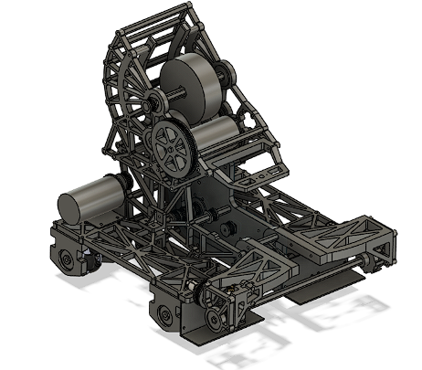

**Welcome to my portfolio website!**

# Getting started

This Mainpage will document my personal development of my ME507 project. My main contribution to this project was the entirety of the electronics and PCB design. However, I had major contributions to software and mechanical hardware. I aim to develop the website more and place this documentation into the projects folder. However, due to time constraints, the ME 507 documentation is here. 

# Mechanical Robot Construction

The mechanical design of our robot is especially something I would like to show. The primary mechanical subsystems are the ball intake, the conveyor, the shooter, and the drive train. Below is an image of our completed CAD of the robot.

Here is a picture of the completed robot as a whole.

The intake system is especially elegant and it is something that I had a major role in developing. It is probably the most complex and well-working subsystem on the robot. We wanted a full-length intake system that actively funneled the balls into a single row for passing into the flywheel. We accomplished this by having a main roller made of rubber bands stretched into a cylinder sucking balls onto a ledge with sideways timing belts funneling into a center timing belt conveyor. I prototyped this rubber band roller, proved that it would work, and set optimal dimensions to be put into CAD.

It is possible that two balls get sucked up at the same time and arrive at the center belt at the same time, creating a jam condition. To prevent this, we added PTFE tape to the bottom of the polycarbonate lip which allowed one jammed ball to slip while the ball on the other side is forced to the center. A video demonstration of the intake as a whole working can be found [here](https://photos.app.goo.gl/mrP9vR2dfU3nwFN7A), and videos of demonstrating the prevention of a jam condition can be found [here](https://photos.app.goo.gl/hB7bNt9KaDPgHy7h6) and [here](https://photos.app.goo.gl/zF647jZhAiVYDyQy6). Additionally, the intake while active is outside of the starting box defined in the rules. Upon driving out of the starting area, the bump disturbs the stowed intake and it deploys into position passively. A video demonstration of the intake being deployed from the stowed position can be found [here](https://photos.app.goo.gl/BCNLPfSVLKeKbNdK9).

# Electronics Construction

# Software

This website is a collection of regular (R)Markdown document, so you can use all the usual formatting.

If you are new to R Markdown, you can learn more about it [on the R Markdown website](https://rmarkdown.rstudio.com/). 

I also have a discussion of R Markdown and reproducibility [on one of my course pages](https://andreashandel.github.io/MADAcourse/1e_ToolsforReproducibility.html). You'll find additional links to potentially useful R Markdown (and Github) resources there.

