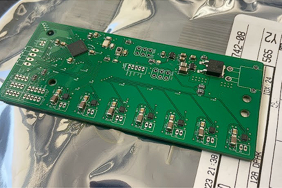
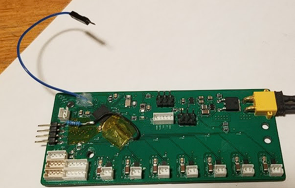

**Welcome to my portfolio website!**

# Getting started

This Mainpage will document my personal development of my ME507 project. My main contribution to this project was the entirety of the electronics and PCB design. However, I had major contributions to software and mechanical hardware. I aim to develop the website more and place this documentation into the projects folder. However, due to time constraints, the ME 507 documentation is here. 

# Mechanical Robot Construction

The mechanical design of our robot is especially something I would like to show. The primary mechanical subsystems are the ball intake, the conveyor, the shooter, and the drive train. Below is an image of our completed CAD of the robot.

Here is a picture of the completed robot as a whole.

The intake system is especially elegant and it is something that I had a major role in developing. It is probably the most complex and well-working subsystem on the robot. We wanted a full-length intake system that actively funneled the balls into a single row for passing into the flywheel. We accomplished this by having a main roller made of rubber bands stretched into a cylinder sucking balls onto a ledge with sideways timing belts funneling into a center timing belt conveyor. I prototyped this rubber band roller, proved that it would work, and set optimal dimensions to be put into CAD.

It is possible that two balls get sucked up at the same time and arrive at the center belt at the same time, creating a jam condition. To prevent this, we added PTFE tape to the bottom of the polycarbonate lip which allowed one jammed ball to slip while the ball on the other side is forced to the center. A video demonstration of the intake as a whole working can be found [here](https://photos.app.goo.gl/mrP9vR2dfU3nwFN7A), and videos of demonstrating the prevention of a jam condition can be found [here](https://photos.app.goo.gl/hB7bNt9KaDPgHy7h6) and [here](https://photos.app.goo.gl/zF647jZhAiVYDyQy6). Additionally, the intake while active is outside of the starting box defined in the rules. Upon driving out of the starting area, the bump disturbs the stowed intake and it deploys into position passively. A video demonstration of the intake being deployed from the stowed position can be found [here](https://photos.app.goo.gl/BCNLPfSVLKeKbNdK9).

# Electronics Construction

My major contribution to the team was the electrical portion of the project. I would say that I completed 100% ALL of the electrical work. This includes designing, component selection, soldering, modifying, and reworking the PCB, as well as wiring all of the peripherals to the PCB. I was also responsible for the deadman switch. I was able to produce a Homework #4 assignment, and the feedback I received on the assignment through Canvas allowed me to make a functioning power regulation system that worked flawlessly on the final PCB. 

I particularly am proud of the motor driver selection and design, despite having to go through several iterations with different drivers. The end result featured drivers that were controlled with phase/enable pins. This enabled us to have a total of 7 drivers with forward and reverse pwm control. Two of the motor drivers controlled two motors with a Y cable, totaling 9 driven motors on our robot. Below, you can see the PCB after hot plate reflow soldering. The 7 motor drivers can be seen at the bottom of the board.

I also handled all of the rework which I am proud of. The selected motor drivers were very small which caused bridging and connectivity issues between the pins on 5 of the 7 drivers on the initial hotplate soldering job. It took quite some time, but all of the drivers were brought to working condition with both soldering iron and hot air techniques. I also did not pull the BOOT0 pin to ground with a resistor on the initial pcb design, so I had to perform rework to do that. Finally, a slave select wire for the SPI channel used by the pixycam needed to be added, which I soldered an extra wire to a spare test pad of the last remaining empty GPIO pin. The final PCB board with all the rework performed can be seen below

Overall, I am very proud of my job in making the PCB.

# Software

For my contributions to software, I made a driver forthe color sensing driver for the lab #4 send/receive sensor input assignment, and to be implamented on the robot. This diver interfaced with the proximity/color sensor just below our flywheel, which was able to identify if a ball was present, and then tell the color of the ball that is present in front of the ball. I was able to get it responsive enough to detect a ball’s presence and color in freefall in front of it. A video of this working can be found [here](https://photos.app.goo.gl/Uh5JVtPXgWMbSKum9).

# Overview and Parting Thoughts

Although all the functionality of our robot was not completely finished, I am confident that it would work flawlessly if given just a couple more days. I believe this was a common theme for all of the participating teams. All the mechanical and electrical components have been tested and proven to work individually, and the code structure is nearly complete. A video of the robot functioning as one unit can be found here. A final video of the robot working can be found [here](https://photos.app.goo.gl/BCNLPfSVLKeKbNdK9). Overall, I am proud of the work that I put in and the product that came out.
